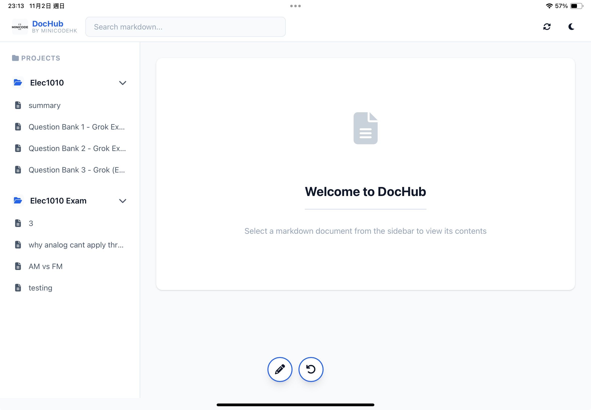
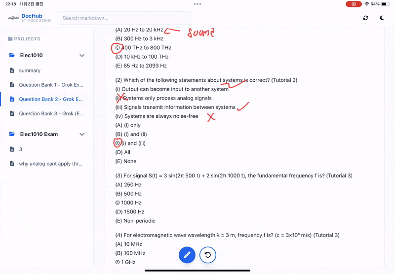

# DocHub - Markdown CMS 

Built on top of **[EZAPI](https://github.com/Minicode-HK/ezapi-go)** - a zero-setup REST API framework for Go.

---

## What is DocHub?

**DocHub** is a minimalist markdown CMS that solves a real problem: *You ask AI to summarize, generate, or process your notes. Now how can I access them everywhere without setting webserver, [quick-note-host](https://github.com/Ryuuu825/quick-notes-host), cdn, or sth like that EVERYTIME like a crazy person?*

*DocHub* are here to save your day.

---

## Core Features

### Markdown Upload & Management

- **Project-Based Structure** - Organize documentation by project. COMP3711 have sets of notes, COMP2012 have another sets of notes...

### Modern Frontend Experience

- **Light/Dark Mode Toggle** - Automatic theme switching with smooth transitions
- **Responsive Design** - Works seamlessly on desktop, tablet, and mobile
- **PWA Support** - Install as an app on your phone
- **Fast & Lightweight** - No heavy JavaScript frameworks, pure vanilla JS

### Drawing & Annotation Features 
Just like goodnotes, write whatever you want on top of your documentation.

---
